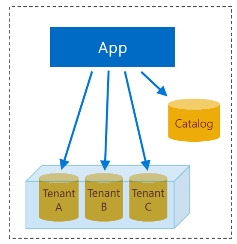

# Multi-tenant SaaS Application

This guide shows how to develop a simple multi-tenant SaaS application.
 
## Requirements

The guide is based on following technologies:

- Visual Studio 2017 or above or Visual Studio Code
- .Net Core 2.1
- MSSQL (Azure Sql)
- At least two registered domains to be able to configure the Azure Web App with the certificates
- Self-signed certificates for development
 
> **Note:** in my case I registed eazuredemo1.com and eazuredemo2.com.


## Solution

Solution approach:

- Application deployed with SNI certificates (same IP with multiple host names)
- Application determines the host name and renders content specific to tenant
- User is presetend with a login screen
  - After authentication, if the user has a claim indicating that he has access to the site, the user is authorized and all database calls are made to authorized tenant database
  

### Database model and solution design



### Step 1

Create a database:

```sql
create database ContosoExpensesdb;
```

### Step 2

Create a catalog table:

```sql
create table Catalog 
(
    TenantId varchar(50) not null primary key,
    Description varchar(50) not null,
    Server varchar(50) not null,
    Database varchar(50) not null,
    Port varchar(10) not null default 1433    
)
```

This table will be used to determine the database information after the user has logged in.

### Step 3

Create a a Catalog table:

```sql
create table Expense
(
    TransactionId int not null primary key,
    Description varchar(50) not null,
    Amount money not null default 0,
    CreatedBy varchar(50) not null,
    CreatedDate datetime not null default getutcdate()
)
```

### Step 4

Generate the self-signed certificates for each of the domains. In my case, I purchased eazuredemo1.com and azuredemo2.com.

```powershell
# Domain
$rootCAdomain = "ezuredemo.com"
$domain1 = "www.eazuredemo1.com"
$apidomain1 = "api.azuredemo1.com"
$domain2 = "www.eazuredemo2.com"
$apidomain2 = "api.azuredemo2.com"
$secret = "P@ssword1"
$pfxPassword = ConvertTo-SecureString -String $secret -Force -AsPlainText
$path = $PWD
$certStore = "cert:\CurrentUser\My"

# Generate the Root CA, remember to export the public key
$rootCert = New-SelfSignedCertificate -Type Custom -KeySpec Signature `
-Subject "CN=$rootCAdomain" -KeyExportPolicy Exportable `
-HashAlgorithm sha256 -KeyLength 2048 `
-CertStoreLocation "$certStore" -KeyUsageProperty Sign -KeyUsage CertSign

# Export the pfx certificate
$rootCertThumbprint = $certStore + "\" + $rootCert.Thumbprint
$fileName = "D:\certs\azuredemo\rootCA.$rootCAdomain.pfx" 
Export-PfxCertificate -cert $rootCertThumbprint -FilePath $fileName -Password $pfxPassword

# Export the public key as a X.509 .CER
$fileName = "D:\certs\azuredemo\rootCA.$rootCAdomain.cer"
Export-Certificate -Cert $rootCertThumbprint -FilePath $fileName

# Generate a self-signed for eazuredemo1.com
$wwwCert1 = New-SelfSignedCertificate `
-DnsName "$domain1" `
-HashAlgorithm sha256 -KeyLength 2048 `
-Signer $rootCert `
-CertStoreLocation "$certStore"

# Export the eazuredemo1.com pfx
$wwwCert1Thumbprint = $certStore + "\" + $wwwCert1.Thumbprint
$fileName = "D:\certs\azuredemo\$domain1.pfx" 
Export-PfxCertificate -cert $wwwCert1Thumbprint -FilePath $fileName -Password $pfxPassword

# Generate a self-signed for eazuredemo1.com
$wwwCert2 = New-SelfSignedCertificate `
-DnsName "$domain2" `
-HashAlgorithm sha256 -KeyLength 2048 `
-Signer $rootCert `
-CertStoreLocation "$certStore"

# Export the eazuredemo2.com
$wwwCert2Thumbprint = $certStore + "\" + $wwwCert2.Thumbprint
$fileName = "D:\certs\azuredemo\$domain2.pfx" 
Export-PfxCertificate -cert $wwwCert2Thumbprint -FilePath $fileName -Password $pfxPassword

```

### Step 4


## References

- [Multi-tenant SaaS database tenancy patterns](https://docs.microsoft.com/en-us/azure/sql-database/saas-tenancy-app-design-patterns)